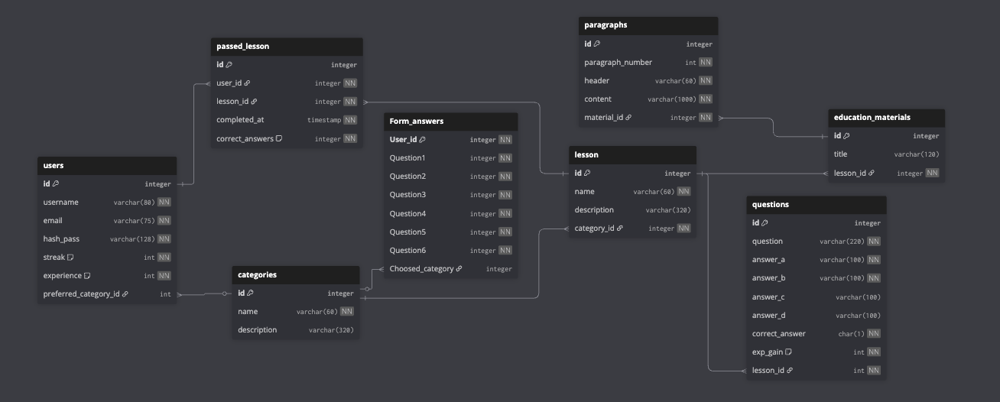

# Server HackHeros

Backend przygotowany na konkurs HackHeroes. 

## Technologie

Poniżej zestawienie głównych narzędzi i technologii wykorzystanych w projekcie.


| Obszar        | Technologia |
|---------------|:-----------:|
| Język         |  Kotlin |
| Framework     |  Ktor |
| Baza danych   |  MySQL |
| Build system  |  Gradle |
| JVM           |  Temurin JDK 21 |


Repozytorium projektu dostępne jest pod adresem:  
**[Pobierz projekt z GitHub](https://github.com/Kubusiowy/Server-HackHeros)**
---
## backend dziala na serwerze u mnie w domu pod adresem -> http://194.28.222.28:8080
 

---

## Wymagania środowiskowe

Aby uruchomić projekt, wymagane są:

- JDK 21 (Temurin)
- MySQL uruchomiony na porcie `3306`
- IntelliJ IDEA (zalecane Ultimate, dopuszczalne Community)
- Gradle (projekt korzysta z wbudowanego wrappera)
- 
### Wersje

- Kotlin: 2.x
- Ktor: 3.x
- JDK: Temurin 21
- Gradle: wrapper (wersja zgodna z projektem)
---

## Instalacja

### 1. Przygotowanie bazy danych MySQL

Uruchom MySQL na porcie `8889`.

Pobierz i zaimportuj strukturę bazy danych:

[dbMySql.sql](SQL/HackHeros.sql)

Diagram struktury tabel:



---

### 2. Instalacja JDK 21 (Temurin)

Pobierz odpowiednie wydanie JDK:

https://adoptium.net/en-GB/temurin/releases?version=21&os=any&arch=any

Po instalacji upewnij się, że JDK jest dodane do zmiennej systemowej PATH.

---

### 3. Konfiguracja IntelliJ IDEA

Otwórz projekt, a następnie przejdź do:

**File → Project Structure**

Ustawienia:

| Opcja          | Wartość                                   |
|----------------|--------------------------------------------|
| SDK            | temurin-21 (Eclipse Temurin 21.0.x)        |
| Language Level | SDK default                                |

Następnie przejdź do:

**Run → Edit Configurations**

Upewnij się, że opcja build/run korzysta z **Java 21**.

---

## Uruchamianie serwera

W katalogu projektu wykonaj:

```bash
./gradlew run
```
</br></br></br></br>
## Endpointy API

Poniżej znajduje się kompletna dokumentacja endpointów dostępnych w serwerze.
</br>
### Status serwera

**GET** `/api/status`

Sprawdza, czy backend działa poprawnie.

**Przykładowa odpowiedź:**
```txt
OK
```

</br>

### Kategorie


**GET** `/api/categories`

Zwraca listę wszystkich kategorii.

**Przykładowa odpowiedź:**

```json
[
  {
        "id": 1,
        "name": "Algorytmy",
        "description": "Podstawy algorytmiki, złożoność obliczeniowa i proste struktury danych."
  }
]
```
</br>

### Lekcje w kategorii


**GET** `/api/categories/lesson/{id}`

`{id}` — identyfikator kategorii (`categories.id`)

Zwraca wszystkie lekcje należące do wskazanej kategorii.

**Przykładowa odpowiedź:**

```json
[
    {
        "id": 3,
        "name": "Podstawy cyberbezpieczeństwa",
        "description": "Bezpieczne hasła, uwierzytelnianie oraz podstawowe typy ataków.",
        "category_id": 2
    }
]
```
</br>

### Materiały edukacyjne dla lekcji


**GET** `/api/education-materials/lessons/{id}`

`{id}` — identyfikator lekcji (`lesson.id`)

Zwraca listę materiałów edukacyjnych powiązanych z daną lekcją.

**Przykładowa odpowiedź:**

```json
[
    {
        "id": 1,
        "title": "Algorytmy w życiu codziennym",
        "lessonId": 1
    }
]
```
</br>

### Paragrafy dla materiału edukacyjnego


**GET** `/api/education-materials/paragraphs/{id}`

`{id}` — identyfikator materiału (`education_materials.id`)

Zwraca paragrafy przypisane do wybranego materiału.

**Przykładowa odpowiedź:**

```json
[
       {
        "id": 1,
        "paragraph_number": 1,
        "header": "Co to jest algorytm?",
        "content": "Algorytm to przepis na rozwiązanie problemu. Może to być przepis na ciasto albo instrukcja dla programu.",
        "material_id": 1
    }
]
```

</br>

### Podsumowanie API

| Endpoint                                         | Metoda | Opis                               |
|--------------------------------------------------|--------|------------------------------------|
| `/api/status`                                          | GET    | Status serwera                    |
| `/api/categories`                                | GET    | Lista kategorii                   |
| `/api/categories/lessons/{id}`                   | GET    | Lekcje danej kategorii            |
| `/api/education-materials/lesson/{id}`           | GET    | Materiały edukacyjne dla lekcji   |
| `/api/education-materials/paragraphs/{id}`       | GET    | Paragrafy materiału edukacyjnego  |
